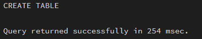
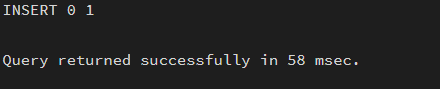
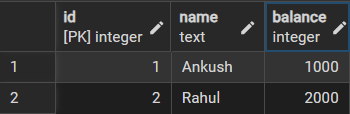
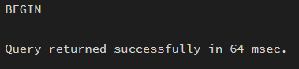
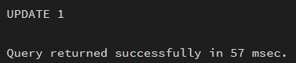
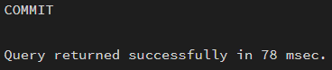
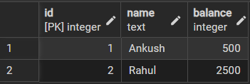
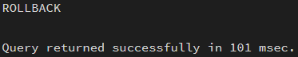
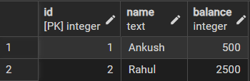
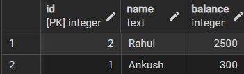

# Worksheet No. - 10

**Student Name:** Ankush kumar\
**UID:** 25MCA20305\
**Branch:** MCA\
**Section/Group:** 1A\
**Semester:** 2nd\
**Date of Performance:** 21st Apr, 2026\
**Subject Name:** TECHNICAL TRAINING\
**Subject Code:** 25CAP-652

---


## Aim / Overview of the Practical
To practically apply transaction management concepts and verify how transaction control ensures consistency and integrity.

## Objective
- Implement transactions with proper syntax  
- Use ROLLBACK for error recovery  
- Apply SAVEPOINT for partial rollbacks  

---

## Procedure / Algorithm / Code

### 1. Create Sample Table

```sql
CREATE TABLE accounts (
    id SERIAL PRIMARY KEY,
    name TEXT,
    balance INT
);
```

------------------------------------------------------------------------

### 2. Insert Initial Data

```sql
INSERT INTO accounts(name, balance) VALUES ('Ankush', 1000);
INSERT INTO accounts(name, balance) VALUES ('Rahul', 2000);
```


------------------------------------------------------------------------

### 3. Start Transaction

```sql
BEGIN;
```


------------------------------------------------------------------------

### 4. Perform Operations

```sql
UPDATE accounts SET balance = balance - 500 WHERE name = 'Ankush';
UPDATE accounts SET balance = balance + 500 WHERE name = 'Rahul';
```


------------------------------------------------------------------------

### 5. Commit Transaction

```sql
COMMIT;
```



------------------------------------------------------------------------

### 6. Transaction with Rollback (Error Handling)

```sql
BEGIN;

UPDATE accounts SET balance = balance - 300 WHERE name = 'Ankush';

-- Simulated error
ROLLBACK;
```



------------------------------------------------------------------------

### 7. Transaction with Savepoint

```sql
BEGIN;

UPDATE accounts SET balance = balance - 200 WHERE name = 'Ankush';

SAVEPOINT sp1;

UPDATE accounts SET balance = balance + 200 WHERE name = 'Rahul';

-- Rollback only second operation
ROLLBACK TO sp1;

COMMIT;
```


------------------------------------------------------------------------

### 8. View Final Data

```sql
SELECT * FROM accounts;
```


---
## Learning Outcomes (What I have learnt)
1. I learned how to use BEGIN, COMMIT, and ROLLBACK to control transactions and ensure that database operations are either fully completed or completely undone.
2. I understood how ROLLBACK helps in error handling by restoring the database to its previous consistent state when something goes wrong.
3. I learned the use of SAVEPOINT to perform partial rollbacks, allowing me to undo specific steps within a transaction without affecting earlier valid operations.
4. I realized the importance of transactions in maintaining data consistency and integrity, especially in real-world scenarios like money transfers between accounts.