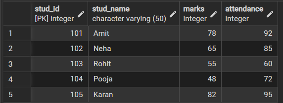
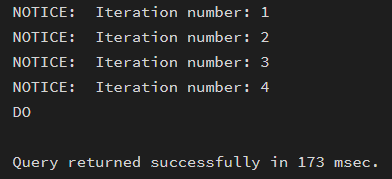
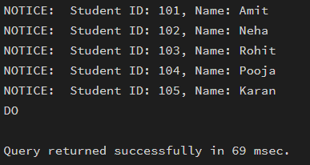
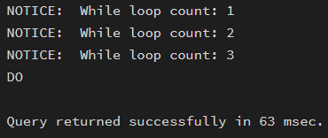
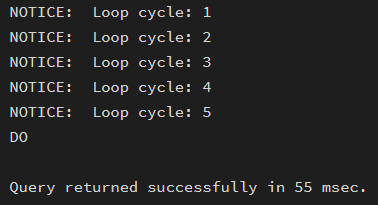
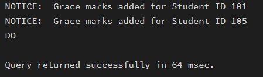
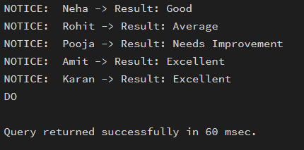

# Worksheet No- 4

**Name:** Ankush Kumar  
**UID:** 25MCA20305  
**Branch:** MCA  
**Section:** MCA-1(A)  
**Semester:** 2  
**Date of Performance:** 3rd Feb, 2026  
**Subject:** Technical Training  
**Subject Code:** 25CAP-652_25MCA_KAR-1_A  

---

## Aim / Overview of the Practical

To understand and implement iterative control structures in PostgreSQL conceptually, including FOR loops, WHILE loops, and basic LOOP constructs, for repeated execution of database logic.

---

## Software Requirements

- PostgreSQL

---

## Objectives

- To understand why iteration is required in database programming  
- To learn the purpose and behaviour of FOR, WHILE, and LOOP constructs  
- To understand how repeated data processing is handled in databases  
- To relate loop concepts to real-world batch processing scenarios  
- To strengthen conceptual knowledge of procedural SQL used in enterprise systems  

---

## Theory

In database applications, some tasks must be repeated on multiple records, such as updating marks, checking attendance, or generating results. While SQL handles single queries well, repeated logic needs procedural control.

PostgreSQL provides PL/pgSQL, which supports loop structures to execute statements multiple times based on conditions.

These loops are commonly used inside:
- Functions  
- Stored procedures  
- Anonymous blocks (`DO $$`)  

---

## Types of Loops in PostgreSQL

### 1. FOR Loop (Range-Based)

- Executes a fixed number of times  
- Useful when the number of iterations is known in advance  
- Commonly used for counters, testing, and batch execution  

### 2. FOR Loop (Query-Based)

- Iterates over rows returned by a query  
- Processes one row at a time  
- Frequently used for reporting, audits, and row-wise calculations  

### 3. WHILE Loop

- Executes repeatedly as long as a condition remains true  
- Suitable for condition-controlled execution  
- Often used in retry logic or threshold-based processing  

### 4. LOOP with EXIT Condition

- Executes indefinitely until explicitly stopped  
- Provides maximum control over execution flow  
- Used in complex workflows where exit conditions are custom-defined  

---

## Experiment Steps

### Example 1: FOR Loop – Simple Iteration

- The loop runs a fixed number of times  
- Each iteration represents one execution cycle  
- Useful for understanding basic loop behaviour  

**Application:** Counters, repeated tasks, batch execution  

---

### Example 2: FOR Loop with Query (Row-by-Row Processing)

- The loop processes database records one at a time  
- Each iteration handles a single row  
- Simulates cursor-based processing  

**Application:** Employee reports, audits, data verification  

---

### Example 3: WHILE Loop – Conditional Iteration

- The loop runs until a condition becomes false  
- Execution depends entirely on the condition  
- The condition is checked before every iteration  

**Application:** Retry mechanisms, validation loops  

---

### Example 4: LOOP with EXIT WHEN

- The loop does not stop automatically  
- An explicit exit condition controls termination  
- Gives flexibility in complex logic  

**Application:** Workflow engines, complex decision cycles  

---

### Example 5: Salary Increment Using FOR Loop

- Employee records are processed one by one  
- Salary values are updated iteratively  
- Represents real-world payroll processing  

**Application:** Payroll systems, bulk updates  

---

### Example 6: Combining LOOP with IF Condition

- Loop processes each record  
- Conditional logic classifies data during iteration  
- Demonstrates decision-making inside loops  

**Application:** Employee grading, alerts, categorization logic  

---

## RESULT

This experiment helps students understand how iterative control structures work in PostgreSQL at a conceptual level. Students learn where and why loops are used in database systems and gain foundational knowledge required for writing procedural logic in enterprise-grade applications.

---

## Coding and Output

```sql
CREATE TABLE students (
  stud_id INT PRIMARY KEY,
  stud_name VARCHAR(50),
  marks INT,
  attendance INT
);

INSERT INTO students VALUES
(101, 'Amit', 78, 92),
(102, 'Neha', 65, 85),
(103, 'Rohit', 55, 60),
(104, 'Pooja', 48, 72),
(105, 'Karan', 82, 95);

SELECT * FROM students;

```


---

### Example 1 — FOR Loop (Simple Counter)

```sql
DO $$
DECLARE
  i INT;
BEGIN
  FOR i IN 1..4 LOOP
    RAISE NOTICE 'Iteration number: %', i;
  END LOOP;
END $$;
```


---

### Example 2 — FOR Loop with Query

```sql
DO $$
DECLARE
  rec RECORD;
BEGIN
  FOR rec IN SELECT stud_id, stud_name FROM students LOOP
    RAISE NOTICE 'Student ID: %, Name: %', rec.stud_id, rec.stud_name;
  END LOOP;
END $$;
```


---

### Example 3 — WHILE Loop

```sql
DO $$
DECLARE
  cnt INT := 1;
BEGIN
  WHILE cnt <= 3 LOOP
    RAISE NOTICE 'While loop count: %', cnt;
    cnt := cnt + 1;
  END LOOP;
END $$;
```


---

### Example 4 — LOOP with EXIT WHEN

```sql
DO $$
DECLARE
  num INT := 1;
BEGIN
  LOOP
    RAISE NOTICE 'Loop cycle: %', num;
    num := num + 1;
    EXIT WHEN num > 5;
  END LOOP;
END $$;
```


---

### Example 5 — Give Bonus Marks Based on Attendance

```sql
DO $$
DECLARE
  rec RECORD;
BEGIN
  FOR rec IN SELECT stud_id, attendance FROM students LOOP
    IF rec.attendance > 90 THEN
      UPDATE students
      SET marks = marks + 5
      WHERE stud_id = rec.stud_id;

      RAISE NOTICE 'Grace marks added for Student ID %', rec.stud_id;
    END IF;
  END LOOP;
END $$;
```


---

### Example 6 — Result Classification Using IF inside LOOP

```sql
DO $$
DECLARE
  rec RECORD;
BEGIN
  FOR rec IN SELECT stud_name, marks FROM students LOOP
    IF rec.marks >= 75 THEN
      RAISE NOTICE '% -> Result: Excellent', rec.stud_name;
    ELSIF rec.marks >= 60 THEN
      RAISE NOTICE '% -> Result: Good', rec.stud_name;
    ELSIF rec.marks >= 50 THEN
      RAISE NOTICE '% -> Result: Average', rec.stud_name;
    ELSE
      RAISE NOTICE '% -> Result: Needs Improvement', rec.stud_name;
    END IF;
  END LOOP;
END $$;
```


---

## Learning Outcome

- Understand the need for iteration in database programming  
- Learn the use of FOR, WHILE, and LOOP constructs in PostgreSQL  
- Perform row-by-row processing using query-based FOR loops  
- Use RECORD and scalar variables correctly in loops  
- Apply conditional logic inside loops  
- Execute batch operations such as salary updates  
- Understand control flow using EXIT conditions  
- Gain basic proficiency in PL/pgSQL programming  
