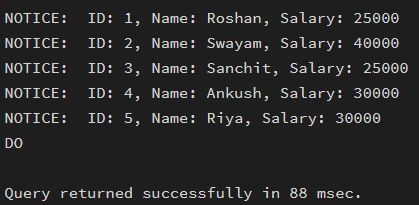
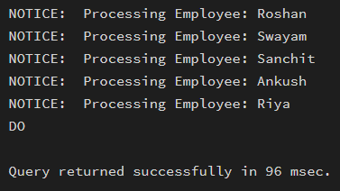

# Worksheet No. - 5

**Student Name:** Ankush kumar\
**UID:** 25MCA20305\
**Branch:** MCA\
**Section/Group:** 1A\
**Semester:** 2nd\
**Date of Performance:** 10th Feb, 2026\
**Subject Name:** TECHNICAL TRAINING\
**Subject Code:** 25CAP-652

------------------------------------------------------------------------

## Aim/Overview of the Practical

To gain hands-on experience in creating and using cursors for row-by-row
processing in a database, enabling sequential access and manipulation of
query results for complex business logic.

------------------------------------------------------------------------

## Objective

-   **Sequential Data Access:** To understand how to fetch rows one by
    one from a result set using cursor mechanisms.\
-   **Row-Level Manipulation:** To perform specific operations or
    calculations on individual records that require conditional
    procedural logic.\
-   **Resource Management:** To learn the lifecycle of a cursor:
    Declaring, Opening, Fetching, and importantly, Closing and
    Deallocating to manage system memory.\
-   **Exception Handling:** To handle cursor-related errors and
    performance considerations during large-scale data iteration.

------------------------------------------------------------------------

## Input/Apparatus Used

-   PostgreSQL\
-   pgAdmin

------------------------------------------------------------------------

## Procedure / Algorithm / Code

``` sql
CREATE TABLE employee (
    emp_id INT PRIMARY KEY,
    emp_name VARCHAR(50),
    salary INT,
    experience INT,
    performance VARCHAR(1)
);

INSERT INTO employee VALUES
(1, 'Roshan', 25000, 5, 'B'),
(2, 'Swayam', 40000, 3, 'A'),
(3, 'Sanchit', 25000, 2, 'C'),
(4, 'Ankush', 30000, 4, 'A'),
(5, 'Riya', 30000, 3, 'B');
```

------------------------------------------------------------------------

### 1. Simple Forward-Only Cursor

``` sql
DO $$
DECLARE
    emp_cursor CURSOR FOR
        SELECT emp_id, emp_name, salary FROM employee;
    rec RECORD;
BEGIN
    OPEN emp_cursor;
    LOOP
        FETCH emp_cursor INTO rec;
        EXIT WHEN NOT FOUND;
        RAISE NOTICE 'ID: %, Name: %, Salary: %',
        rec.emp_id, rec.emp_name, rec.salary;
    END LOOP;
    CLOSE emp_cursor;
END $$;
```

------------------------------------------------------------------------

### 2. Complex Row-by-Row Manipulation

``` sql
DO $$
DECLARE
    emp_cursor CURSOR FOR
        SELECT emp_id, salary, experience, performance FROM employee;
    rec RECORD;
    new_salary NUMERIC;
BEGIN
    OPEN emp_cursor;
    LOOP
        FETCH emp_cursor INTO rec;
        EXIT WHEN NOT FOUND;

        IF rec.experience >= 5 AND rec.performance = 'A' THEN
            new_salary := rec.salary * 1.20;
        ELSIF rec.experience >= 3 AND rec.performance = 'B' THEN
            new_salary := rec.salary * 1.10;
        ELSE
            new_salary := rec.salary * 1.05;
        END IF;

        UPDATE employee
        SET salary = new_salary
        WHERE emp_id = rec.emp_id;
    END LOOP;
    CLOSE emp_cursor;
END $$;
```

------------------------------------------------------------------------

### 3. Exception and Status Handling

``` sql
DO $$
DECLARE
    emp_cursor CURSOR FOR SELECT * FROM employee;
    rec RECORD;
BEGIN
    OPEN emp_cursor;
    LOOP
        FETCH emp_cursor INTO rec;
        EXIT WHEN NOT FOUND;
        RAISE NOTICE 'Processing Employee: %', rec.emp_name;
    END LOOP;
    CLOSE emp_cursor;

EXCEPTION
    WHEN OTHERS THEN
        RAISE NOTICE 'Error occurred: %', SQLERRM;
END $$;
```

------------------------------------------------------------------------

## Output
### Simple cursor traversal


### Before Salary Update


### After Salary Update


### Exception and Status Handling


------------------------------------------------------------------------

## Learning Outcomes (What I have learnt)

1.  I learned how to implement and manage cursors properly, including
    declaring, opening, fetching records one by one, and closing them to
    ensure proper resource management.

2.  I understood how to perform row-by-row processing using procedural
    logic, especially when applying conditional salary updates based on
    experience and performance criteria.

3.  I gained practical knowledge of handling exceptions inside cursor
    blocks, ensuring that errors are caught gracefully without crashing
    the execution.

4.  I developed a clear understanding of when to use cursors instead of
    set-based SQL queries, particularly for complex business logic that
    requires individual record validation or manipulation.
