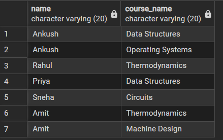
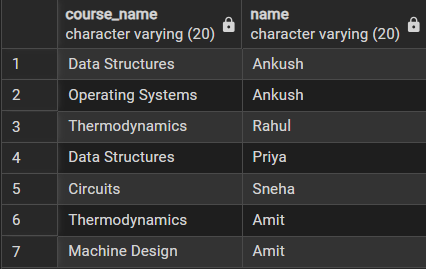
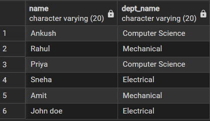
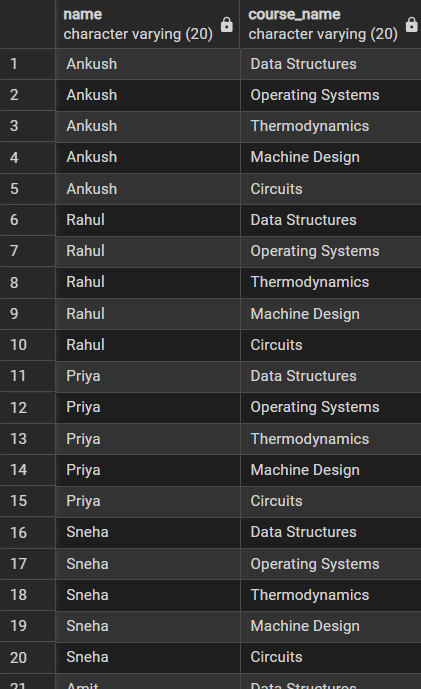

# Worksheet No. - 7

**Student Name:** Ankush kumar\
**UID:** 25MCA20305\
**Branch:** MCA\
**Section/Group:** 1A\
**Semester:** 2nd\
**Date of Performance:** 31th Mar, 2026\
**Subject Name:** TECHNICAL TRAINING\
**Subject Code:** 25CAP-652

------------------------------------------------------------------------

## Aim/Overview of the Practical

Implementation of JOINS in PostgreSQL

------------------------------------------------------------------------

## Objective

-   Apply joins to a real-world database schema (Students, Courses,
    Enrollments, Departments)
-   Write queries using INNER JOIN, LEFT JOIN, RIGHT JOIN, CROSS JOIN

------------------------------------------------------------------------

## Input/Apparatus Used

-   PostgreSQL\
-   pgAdmin

------------------------------------------------------------------------

## Procedure / Algorithm / Code

### 1. Table Creation

``` sql
-- Departments
CREATE TABLE departments (
    id INT PRIMARY KEY,
    dept_name VARCHAR(50)
);

-- Students
CREATE TABLE students (
    id INT PRIMARY KEY,
    name VARCHAR(50),
    dept_id INT,
    FOREIGN KEY (dept_id) REFERENCES departments(id)
);

-- Courses
CREATE TABLE courses (
    id INT PRIMARY KEY,
    course_name VARCHAR(50),
    dept_id INT,
    FOREIGN KEY (dept_id) REFERENCES departments(id)
);

-- Enrollments
CREATE TABLE enrollments (
    id INT PRIMARY KEY,
    student_id INT,
    course_id INT,
    FOREIGN KEY (student_id) REFERENCES students(id),
    FOREIGN KEY (course_id) REFERENCES courses(id)
);
```

------------------------------------------------------------------------

### 2. Data Insertion

``` sql
INSERT INTO departments (id, dept_name) VALUES
(1, 'Computer Science'),
(2, 'Mechanical'),
(3, 'Electrical');

INSERT INTO students (id, name, dept_id) VALUES
(1, 'Ankush', 1),
(2, 'Rahul', 2),
(3, 'Priya', 1),
(4, 'Sneha', 3),
(5, 'Amit', 2),
(6, 'Karan', 1);

INSERT INTO courses (id, course_name, dept_id) VALUES
(1, 'Data Structures', 1),
(2, 'Operating Systems', 1),
(3, 'Thermodynamics', 2),
(4, 'Machine Design', 2),
(5, 'Circuits', 3);

INSERT INTO enrollments (id, student_id, course_id) VALUES
(1, 1, 1),
(2, 1, 2),
(3, 2, 3),
(4, 3, 1),
(5, 4, 5),
(6, 5, 3),
(7, 5, 4);
```

------------------------------------------------------------------------

### 3. Queries

#### Q1. INNER JOIN

``` sql
SELECT s.name, c.course_name
FROM students s
INNER JOIN enrollments e ON s.id = e.student_id
INNER JOIN courses c ON e.course_id = c.id;
```

#### Q2. LEFT JOIN

``` sql
SELECT s.id, s.name
FROM students s
LEFT JOIN enrollments e ON s.id = e.student_id
WHERE e.student_id IS NULL;
```

#### Q3. RIGHT JOIN

``` sql
SELECT c.course_name, s.name
FROM students s
RIGHT JOIN enrollments e ON s.id = e.student_id
RIGHT JOIN courses c ON e.course_id = c.id;
```

#### Q4. MULTIPLE JOIN

``` sql
SELECT s.name, d.dept_name
FROM students s
JOIN departments d ON s.dept_id = d.id;
```

#### Q5. CROSS JOIN

``` sql
SELECT s.name, c.course_name
FROM students s
CROSS JOIN courses c;
```

------------------------------------------------------------------------

## Output

### 1. INNER JOIN Output



### 2. LEFT JOIN Output


### 3. RIGHT JOIN Output



### 4. MULTI JOIN Output



### 5. CROSS JOIN Output



------------------------------------------------------------------------

## Learning Outcomes (What I have learnt)

1.  I learned how to use INNER JOIN to display only matching records
    between students and courses.
2.  I understood that LEFT JOIN combined with IS NULL helps me find
    records that do not have corresponding entries.
3.  I realized that RIGHT JOIN allows inclusion of all records even
    without matches.
4.  I learned how to combine multiple tables using JOIN to retrieve
    related information.
5.  I understood that CROSS JOIN generates all possible combinations
    between two tables.
