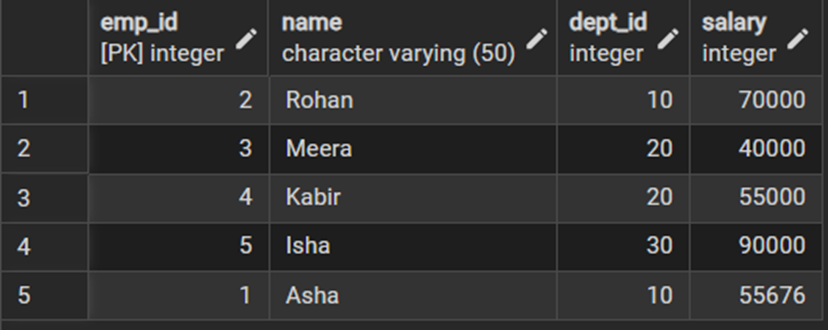
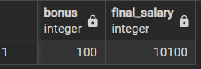
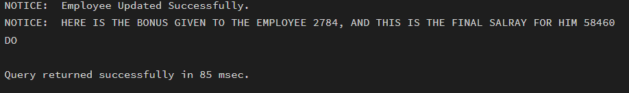
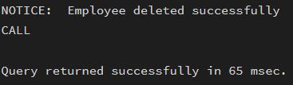
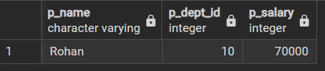

# Worksheet No. - 8

**Student Name:** Ankush kumar\
**UID:** 25MCA20305\
**Branch:** MCA\
**Section/Group:** 1A\
**Semester:** 2nd\
**Date of Performance:** 1st Apr, 2026\
**Subject Name:** TECHNICAL TRAINING\
**Subject Code:** 25CAP-652

------------------------------------------------------------------------

## Aim/Overview of the Practical

Apply stored procedure concepts for database operations

------------------------------------------------------------------------

## Objective

To apply the concept of Stored Procedures in database operations in order to perform tasks like:

- Insertion  
- Updating  
- Deletion  
- Retrieval  

efficiently, securely, and in a reusable manner within the database system.

------------------------------------------------------------------------

## Input/Apparatus Used

- PostgreSQL  
- pgAdmin  

------------------------------------------------------------------------

## Procedure / Algorithm / Code

### 1. Initial Table View

```sql
SELECT * FROM EMPLOYEES;
```

------------------------------------------------------------------------

### 2. Insertion using Stored Procedure

```sql
CREATE OR REPLACE PROCEDURE ADD_NEW_EMPLOYEE(
    IN EMP_ID INT,
    IN NAME VARCHAR(50),
    IN DEPT_ID INT,
    IN SALARY INT
)
LANGUAGE PLPGSQL
AS
$$
BEGIN
    INSERT INTO EMPLOYEES (EMP_ID, NAME, DEPT_ID, SALARY)
    VALUES (EMP_ID, NAME, DEPT_ID, SALARY);
END;
$$;

CALL ADD_NEW_EMPLOYEE(6,'John',30,10000);
```

------------------------------------------------------------------------

### 3. Updating using Stored Procedure

```sql
CREATE OR REPLACE PROCEDURE UPDATE_SALARY(
    IN IDS INT,
    INOUT BONUS INT,
    OUT FINAL_SALARY INT
)
LANGUAGE PLPGSQL
AS
$$
DECLARE
    CURR_SALARY INT := 0;
BEGIN
    SELECT salary INTO CURR_SALARY
    FROM EMPLOYEES
    WHERE EMP_ID = IDS;

    IF NOT FOUND THEN
        RAISE EXCEPTION 'Employee not found';
    END IF;

    BONUS := (BONUS::NUMERIC / 100) * CURR_SALARY;
    FINAL_SALARY := CURR_SALARY + BONUS;

    UPDATE EMPLOYEES
    SET SALARY = FINAL_SALARY
    WHERE EMP_ID = IDS;
END;
$$;

CALL UPDATE_SALARY(1, 1, NULL);

DO
$$
DECLARE
    IDS INT := 1;
    BONUS INT := 5;
    FINAL_SALARY INT;
BEGIN
    CALL UPDATE_SALARY(IDS, BONUS, FINAL_SALARY);

    RAISE NOTICE 'HERE IS THE BONUS GIVEN TO THE EMPLOYEE %, AND THIS IS THE FINAL SALARY FOR HIM %',
    BONUS, FINAL_SALARY;
END;
$$;
```

------------------------------------------------------------------------

### 4. Deletion using Stored Procedure

```sql
CREATE OR REPLACE PROCEDURE delete_employee(
    IN p_emp_id INT
)
LANGUAGE plpgsql
AS
$$
BEGIN
    DELETE FROM employees
    WHERE emp_id = p_emp_id;

    IF NOT FOUND THEN
        RAISE NOTICE 'Employee not found';
    ELSE
        RAISE NOTICE 'Employee deleted successfully';
    END IF;
END;
$$;

CALL delete_employee(6);
```

------------------------------------------------------------------------

### 5. Retrieval using Stored Procedure

```sql
CREATE OR REPLACE PROCEDURE get_employee(
    IN p_emp_id INT,
    OUT p_name VARCHAR,
    OUT p_dept_id INT,
    OUT p_salary INT
)
LANGUAGE plpgsql
AS
$$
BEGIN
    SELECT name, dept_id, salary
    INTO p_name, p_dept_id, p_salary
    FROM employees
    WHERE emp_id = p_emp_id;

    IF NOT FOUND THEN
        RAISE NOTICE 'Employee not found';
    END IF;
END;
$$;

CALL get_employee(2, NULL, NULL, NULL);
```

------------------------------------------------------------------------

## Output

### 1. Initial Employees Table



### 2. Insertion Output



### 3. Updating Output (Direct Call)


### 4. Updating Output (Using Do Block)



### 5. Deletion Output



### 6. Retrieval Output



------------------------------------------------------------------------

## Learning Outcomes (What I have learnt)

1. I learned how to create and use stored procedures to perform insertion, updating, deletion, and retrieval operations in a structured and reusable way.  
2. I understood how to use different parameter types like IN, OUT, and INOUT to pass and return values within procedures.  
3. I gained knowledge of implementing conditional checks such as NOT FOUND to handle cases where records may not exist.  
4. I learned how to execute and test stored procedures using both direct CALL statements and anonymous blocks using DO for better control and output handling.  
