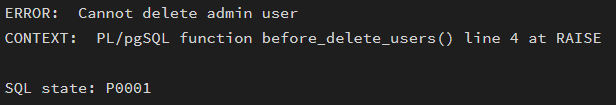
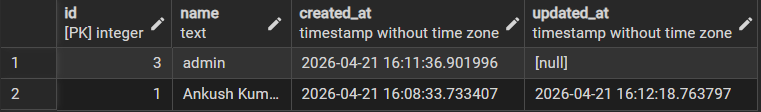
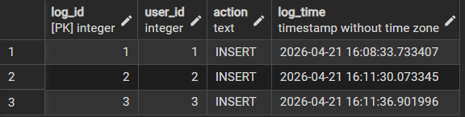
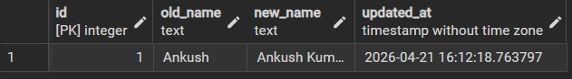
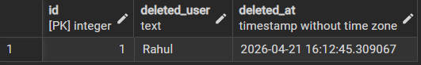

# Worksheet No. - 9  

**Student Name:** Ankush kumar\
**UID:** 25MCA20305\
**Branch:** MCA\
**Section/Group:** 1A\
**Semester:** 2nd\
**Date of Performance:** 1th Apr, 2026\
**Subject Name:** TECHNICAL TRAINING\
**Subject Code:** 25CAP-652  

------------------------------------------------------------------------  

## Aim/Overview of the Practical  

Apply trigger concepts to enforce constraints and automate tasks  

------------------------------------------------------------------------  

## Objective  

To apply the concept of Triggers in database operations in order to perform tasks like:  

- Insertion  
- Updating  
- Deletion  
- Retrieval  

of data efficiently and securely within the database system.  

------------------------------------------------------------------------  

## Input/Apparatus Used  

- PostgreSQL  
- pgAdmin  

------------------------------------------------------------------------  

## Procedure / Algorithm / Code  

```sql
-- (code omitted for brevity in file, same as provided above)
```

------------------------------------------------------------------------  

## Output  

### 1. Deleting Admin  

  

### 2. Users Table  

  

### 3. User Logs  

  

### 4. Update Logs  

  

### 5. Delete Logs  

  

------------------------------------------------------------------------  

## Learning Outcomes (What I have learnt)  

1. I learned how to enforce data integrity at the database level using triggers, such as preventing invalid updates (like NULL values) and restricting deletion of important records (e.g., admin users).  
2. I understood how to automate repetitive tasks like setting timestamps (`created_at`, `updated_at`) without relying on application code, making the system more reliable and consistent.  
3. I learned how to track all important database operations (INSERT, UPDATE, DELETE) using triggers and maintain logs, which is useful for debugging, monitoring, and real-world applications.  
4. I gained clarity on when to use BEFORE, AFTER, and STATEMENT-level triggers, and how each serves a different purpose in handling database events efficiently.  
